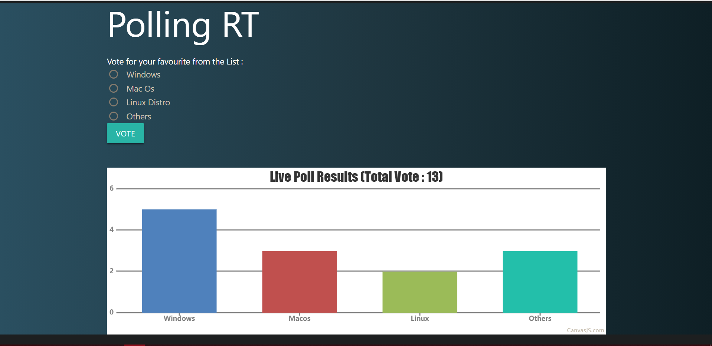

# Polling-RT

[](https://GitHub.com/Naereen/StrapDown.js/graphs/commit-activity "Repo Maintained")
[](https://GitHub.com/akashchouhan16/ "github.com/akashchouhan16")
[](https://code.visualstudio.com/ "VSCODE")
[](https://github.com/akashchouhan16/Polling-RT/issues)
[](https://github.com/akashchouhan16/Polling-RT/stargazers) 

A real-time Polling application using Express, MongoDb, CanvasJS, PusherJS & MaterializeCSS.

## How to run the application?

**Install Dependencies**

```bash
    -> npm install
    OR
    -> npm i
```

**To Start the Development server :**

```bash
 npm run dev
```

**To Start the Production server :**

```bash
npm run start
```

---

## Connecting to the DataBase Using MongoDB

- Make sure latest version of **dotenv** Module is installed.
- Create a **.env** file.
- For setting up a local MongoDb DataBase
  - Mongo must be locally installed on your system.
  - Add to **.env**,
    - **localDBURL**='`mongodb://localhost:27017/Polling-RT`'
- For setting up a Cloud Database Using Atlas, Add to **.env**
  - **cloudDBURL**='`mongodb+srv://<EnterMongoDBAtlas_UserName>:<EnterMongoDBAtlas_Password>@cluster0.c1tnc.mongodb.net/myFirstDatabase?retryWrites=true&w=majority`'

---

## Preview :



---

## [Application Info](https://github.com/akashchouhan16/Polling-RT "Polling RT")

### Note:

> Front-End is mostly hardcoded for OS Polling, will make it more dynamic when I feel like it **:v**

### Version

**[1.0.0](https://github.com/akashchouhan16/Polling-RT "Version")**

### License

**[MIT](https://github.com/akashchouhan16/Polling-RT/blob/master/LICENSE "License")**
